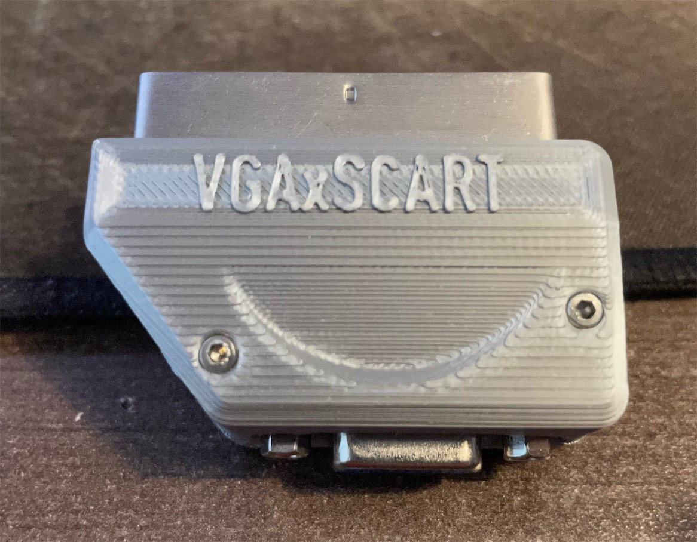
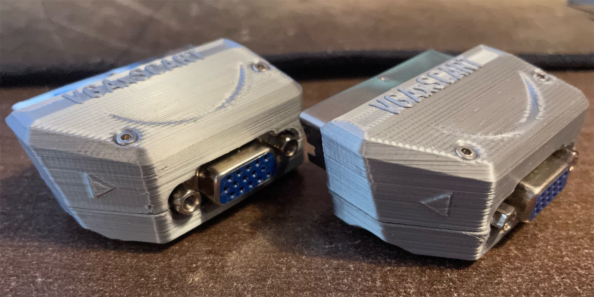
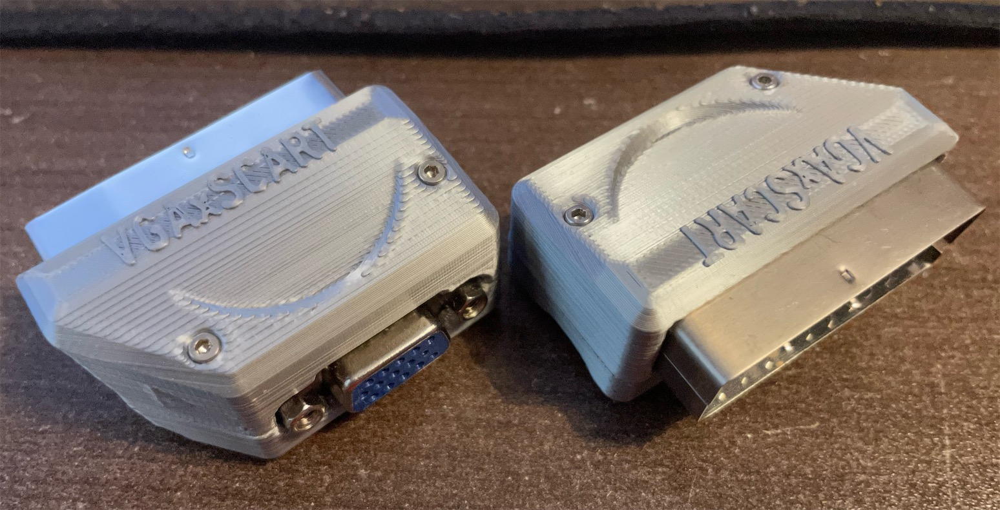
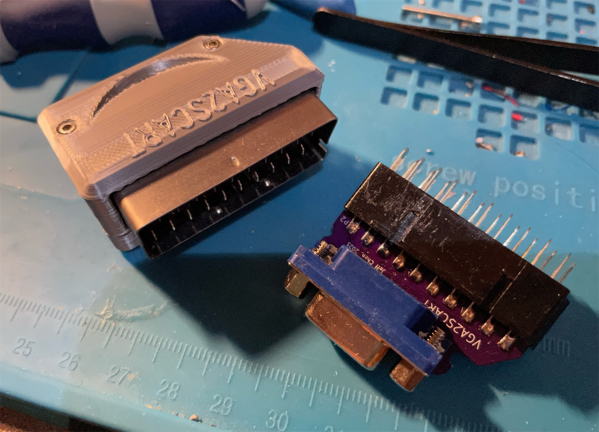
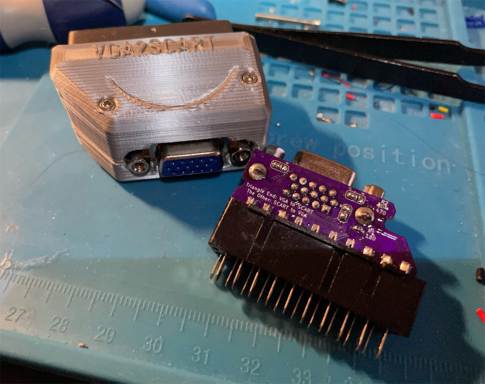
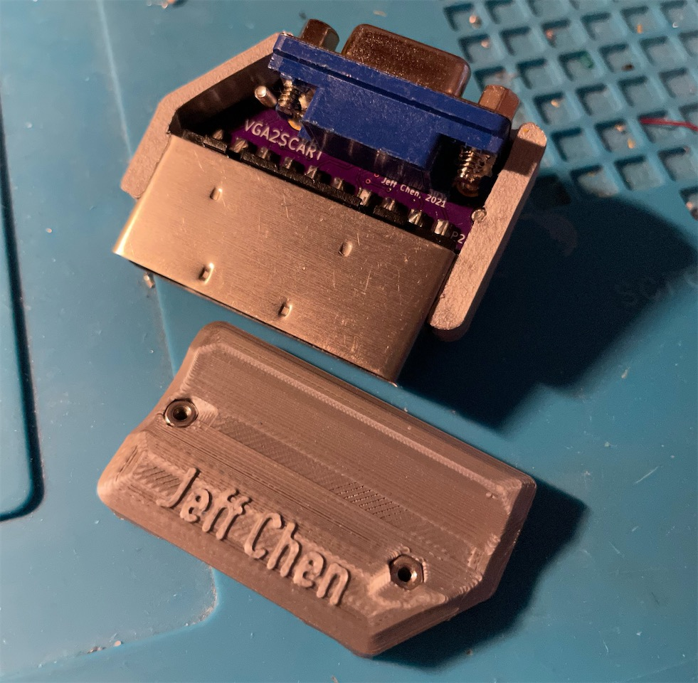

# VGAxSCART

A VGAxSCART Adapter for RGBS. This is one of the different links in my [RGBS dongle series](https://github.com/jeffqchen/Console-VGA-Dongle-Series).

This dongle passes RGB and Sync video signals, as well as stereo audio between SCART and VGA. Note it does not convert H+V Sync from/into CSync.

The SCART fast switching/blanking voltage is preserved for compatibility, while the function switching/aspect ratio voltage is discarded for better safety.

This design is bi-directional. You can choose the direction during assembly by closing the corresponding jumper pads on the PCB.

3D printed shells for each direction are also provided.

--------

## Parts

- [PCB](https://oshpark.com/shared_projects/xI1fDZ8w)

- VGA Port Slim, Female - [Link](https://github.com/jeffqchen/JeffParts/blob/main/Connectors/HD15/Slim/Female%20PCB/info.md)

- SCART Male Plug, Cable Type - [Link](https://github.com/jeffqchen/JeffParts/blob/main/Connectors/SCART/Male%20Cable/info.md)

- [2x] M2x20mm Screws and Nuts - [Link](https://github.com/jeffqchen/JeffParts/blob/main/Parts/M2%20M3%20Hex%20Screw%20%26%20Nut/info.md)

SMD Resistor, 0603 size
- [1x] 180 Ohm
- [1x] 470 Ohm

- 3D Printed Shell

--------

## Assembly

Solder the SMD resistors onto the PCB.

Close the directional jumper with solder:
- Triangle: VGA to SCART
- No triangle: SCART to VGA

Insert the SCART header with its shielding into the top shell. Then fit the PCB without the VGA header in between the two rows of the contacts on the SCART header.

Press the PCB inwards and downwards to hold it in place. Solder down two contacts on the SCART header to the PCB.

Take the assembly out of the shell. Inspect if the SCART plug is straight. If the plug is crooked, melt the soldered contacts and adjust the plug until it is. Otherwise it will be very hard to close up the shell.

 Go on and solder all the rest of the contacts on the SCART header onto the PCB. Make sure the PCB is perpendicular to the bottom of the SCART header Then, solder in the VGA port.

Finally, fit the assembly back into the top shell, and close the bottom shell with the top with two sets of M2x20mm screws and nuts.

Note the screws travel in a slightly diagonal direction. Pay attention to the direction when tightening the screws.
